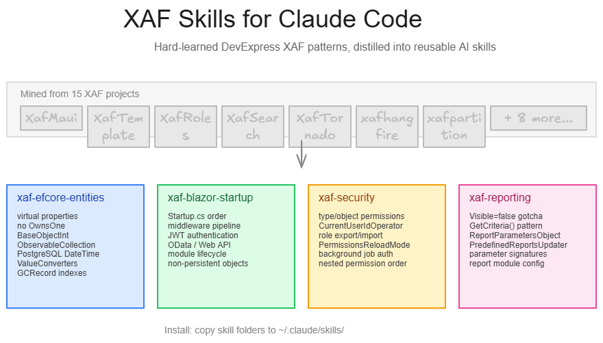

# XAF Skills for Claude Code



Hard-learned lessons from 15+ DevExpress XAF projects, distilled into reusable [Claude Code skills](https://docs.anthropic.com/en/docs/claude-code).

These skills prevent AI coding agents from hitting the silent gotchas that make XAF + EF Core development painful.

## Skills

### Core

| Skill | What it covers |
|---|---|
| **xaf-efcore-entities** | Entity authoring: virtual properties, no OwnsOne, BaseObjectInt, ObservableCollection, decimal precision, PostgreSQL DateTime trap, GCRecord indexes, ValueConverters |
| **xaf-blazor-startup** | Startup.cs configuration: service registration order, middleware pipeline, JWT auth, OData/Web API, module lifecycle, non-persistent objects |
| **xaf-security** | Permissions: type/object/member-level security, role export/import, PermissionsReloadMode, background job auth, CurrentUserIdOperator |
| **xaf-reporting** | ReportsV2: parameter objects, Visible=false gotcha, GetCriteria() vs FilterString, PredefinedReportsUpdater |
| **devexpress-xaf-docker** | Containerizing XAF Blazor: SkiaSharp native deps, DevExpress version pinning, PostgreSQL/MySQL provider setup, schema initialization |

### Patterns

| Skill | What it covers |
|---|---|
| **xaf-hangfire-jobs** | Command/Handler jobs with zero XAF dependency, HangfireJobDispatcher vs DirectJobDispatcher, JobDefinition entity, XafJobScopeInitializer service-account auth, JobSyncService startup reconciliation |
| **xaf-search-panels** | Configurable advanced-search popups with generated `[DomainComponent]` DTOs — and why runtime Roslyn compilation is incompatible with AddSecuredEFCore |
| **xaf-conditional-appearance** | Data-driven appearance rules from the database via AppearanceController.CollectAppearanceRules + IAppearanceRuleProperties adapter, with immediate-effect cache invalidation |
| **xaf-navigation-hub** | Card-based DashboardView launchpad as startup view: IModelNavigationHub, permission-filtered tiles via ShowNavigationItemController, per-user pinned favorites |
| **xaf-environment-auth** | SSO vs password authentication switched by ASPNETCORE_ENVIRONMENT (not #if DEBUG), with the HangfireJob service-account carve-out |
| **xaf-playwright-testing** | E2E testing XAF Blazor with Playwright + NUnit: AuthenticatedTestBase, multi-fallback selectors, screenshot-on-failure, NetworkIdle timing |

## Installation

These skills ship as a Claude Code **plugin** (`xaf-tools`) via this repo's built-in marketplace. Install once per machine:

```text
/plugin marketplace add MBrekhof/xafskills
/plugin install xaf-tools@xafskills
```

That's it. All 11 skills install together and trigger automatically when Claude Code works on matching tasks. To keep machines in sync, enable auto-update for the marketplace (`autoUpdate: true` in your `~/.claude/settings.json` under `extraKnownMarketplaces`) — the plugin tracks the latest commit, so a `git push` here propagates to every machine on its next session.

Update manually at any time with:

```text
/plugin marketplace update xafskills
```

### Manual install (no plugin)

Prefer to copy individual skills? They live under `skills/`:

```bash
cp -r skills/xaf-efcore-entities ~/.claude/skills/      # global (all projects)
cp -r skills/xaf-efcore-entities /path/to/project/.claude/skills/   # per-project
```

## Requirements

- DevExpress XAF v25.2+ with EF Core
- .NET 8.0 or .NET 9.0

## Source

Mined from real production projects covering: dynamic assembly loading, runtime entity creation, Hangfire integration, Elsa workflows, PostgreSQL partitioning, role management, navigation hubs, AI chat integration, report parameter generation, and more.

## License

MIT
